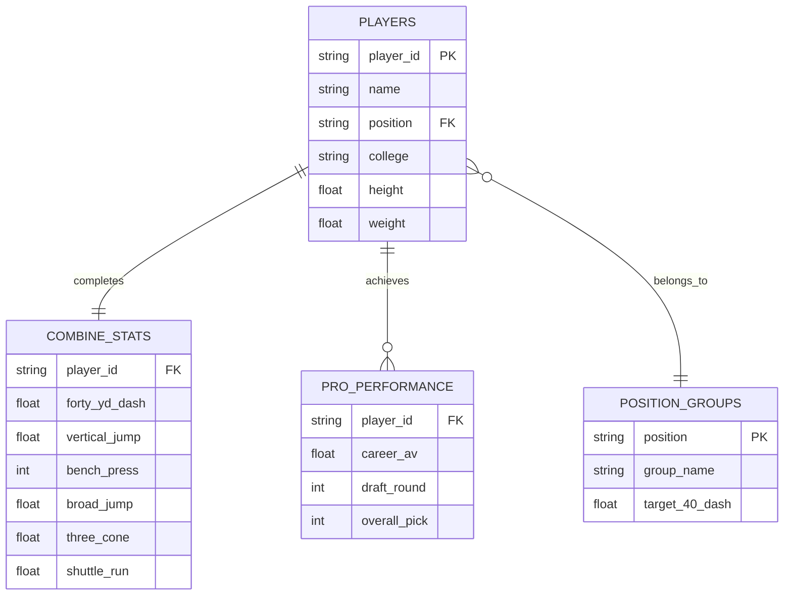
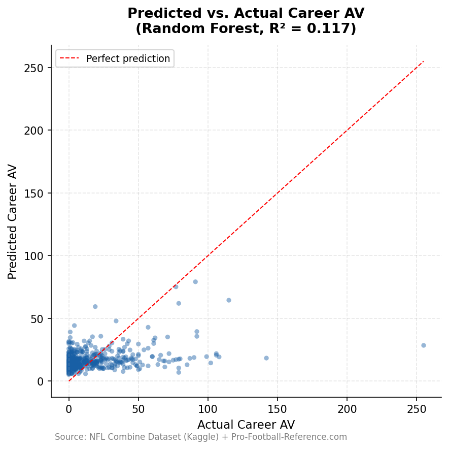

# DS 4320 Project 1: NFL Combine Performance as a Predictor for Career Value

# Project Details

## Executive Summary

This project develops a relational data model (D') derived from historical NFL Combine metrics and professional career statistics. The objective is to identify the correlation between specific athletic "measurables" (speed, explosion, and agility) and a player's long-term professional contribution as measured by Career Approximate Value (CAV). The resulting pipeline transforms raw flat-file data into a normalized database, applies machine learning to predict performance value, and provides position-specific benchmarks for athletic evaluation.

### Name: 
Kieran Perdue
### NetID: 
rrx5eg
### DOI: 
[Insert DOI Link from Zenodo here]
### Press Release: 
press_release.md
### Data: 
[[Link to shared OneDrive folder]
](https://myuva-my.sharepoint.com/:f:/r/personal/rrx5eg_virginia_edu/Documents/Project%201%20Data%20Folder?csf=1&web=1&e=MhzQIg)
### Pipeline (Jupyter): 
pipeline.ipynb
### Pipeline (Markdown): 
pipeline.md
### License: 
MIT

## Problem Definition

General Problem: Projecting athletic performance.

Specific Problem: Predicting a player's "Career Approximate Value" (CAV) based on standardized athletic testing metrics to identify prospects whose professional potential is overlooked by traditional draft valuation.

### Rationale

Current draft models often rely heavily on "draft stock" and collegiate production, which are subject to high variance based on competition level and team scheme. Standardized Combine metrics provide a "level playing field" for physical comparison. By refining the problem to focus on CAV—a position-neutral longevity metric—this project aims to distinguish between players who are simply "workout warriors" and those whose athletic profiles correlate with high-value NFL careers.

### Motivation

The motivation is to provide front-office scouts with a data-driven "Value Index." High-round draft busts represent significant financial and competitive losses for NFL franchises. This project seeks to minimize that risk by establishing athletic threshold baselines that historically lead to professional success.

### Headline 

[put headline here later]
[put anchor link here later]

## Domain Exposition

## Terminology

Terminology

| Term | Definition |
|---|---|
| **CAV** | **Career Approximate Value**: A non-cumulative value metric developed by Pro-Football-Reference to measure a player's contribution to their team. |
| **40-Yard Dash** | A test of absolute explosive speed; the most emphasized metric in traditional scouting. |
| **3-Cone Drill** | A test of agility and lateral change-of-direction, often more predictive for skill positions than straight-line speed. |
| **PVI** | **Performance Value Index**: A custom KPI representing the ratio of professional production to athletic percentile. |
| **Trench (Position Group)** | Linemen who play at the line of scrimmage, primarily responsible for blocking or shedding blocks (e.g., Offensive Line, Defensive Line). |
| **Skill (Position Group)** | Players who primarily handle the football or cover receivers in open space (e.g., Wide Receivers, Running Backs, Defensive Backs). |
| **Big Skill (Position Group)** | Hybrid players who possess both blocking responsibilities and receiving skills (e.g., Tight Ends). |

## Background Readings
**Folder** https://drive.google.com/drive/folders/1aFAPdv9FK4VBSBXO30m4cr7RYpq_7C-N?usp=drive_link 

| Title | Brief Description | Link to File in Folder |
|---|---|---|
| **Explosive Strength and Speed as Potential Determinants of Success in Youth Figure Skating Competitions** | This study demonstrates that explosive strength and speed, measured through field tests like horizontal jumps and ice sprints, are significant predictors of competition success in youth figure skaters. This provides a basis for evaluating raw atheltic talent as a predictor of performance | [View PDF](https://drive.google.com/file/d/1KF_Xz0HvXC-BNFJrZMGD34iZxqKTXmQg/view?usp=drive_link) |
| **Approximate Value** | Detailed documentation of the "Approximate Value" (AV) methodology, providing the framework for our dependent variable used to quantify professional contribution. | [View PDF](https://drive.google.com/file/d/1zr8w3IBZDDnYIt4wSVJuLshf6pgRwpF7/view?usp=drive_link) |
| **Normative and limit values of speed, endurance and power tests results of young football players** | This study established standardized percentile charts for speed, power, and endurance in young male football players aged 12–16, identifying the age of 13 to 14 as a period of significant motor skill development and highlighting the value of these normative benchmarks for individualizing training and monitoring athletic progress. | [View PDF](https://drive.google.com/file/d/18RjztSUuTVU-pEg9qS1dBC2mDrkMCFd7/view?usp=drive_link) |
| **THE NFL COMBINE: DOES IT PREDICT PERFORMANCE IN THE NATIONAL FOOTBALL LEAGUE?** | The 2008 study investigates the predictive validity of the NFL combine and concludes that most physical tests and the Wonderlic Personnel Test fail to consistently correlate with professional success for quarterbacks, wide receivers, and running backs, with the notable exception of sprint tests for running backs. | [View PDF](https://drive.google.com/file/d/1LUen5nk0WU3vVjOuorxo7VwyL39VgPh4/view?usp=drive_link) |
| **Advancing NFL win prediction: from Pythagorean formulas to machine learning algorithms** | A technical paper demonstrating multivariate modeling techniques to aggregate multiple Combine variables into a single, actionable "Value Forecast." | [View PDF](https://drive.google.com/file/d/1pALDEpmU-k3J7suMpHtYE-uVvlnZjxqW/view?usp=drive_link) |

## Data Creation

### Provenance

The raw data for this project was acquired from a Kaggle dataset containing historical NFL Combine results (1999-2022) merged with professional statistics scraped from Pro-Football-Reference.

### Codebase for Data Creation

### Codebase for Data Creation

| File | Description | Link |
|---|---|---|
| `convert_to_parquet.py` | Python script that cleans raw CSV data and converts it into optimized Parquet files for storage. | [Link](./convert_to_parquet.py) |
| `pipeline.ipynb` | Jupyter Notebook containing the DuckDB SQL pipeline that ingests the Parquet files and constructs the relational database (D'). | [Link](./pipeline/pipeline.ipynb) |
| `requirements.txt` | A text file listing the Python dependencies (e.g., duckdb, pandas, pyarrow) required to reproduce this data pipeline. | [Link](./requirements.txt) |

### Bias Identification & Mitigation

Selection Bias: Only top-tier prospects are invited to the NFL Combine. The dataset lacks "average" athletes, creating a high-performance floor.

Survivor Bias: Players who appear in the performance table are those who actually played in the NFL. Prospects who were drafted but never played have a CAV of 0.

### Mitigation: 

We mitigate this by including a POSITION_GROUPS reference table to normalize athletic scores against positional averages rather than the entire population.

## Metadata

### Schema (Logical ER Diagram)

### Data Tables

| Table Name | Description | Link to CSV |
|---|---|---|
| `players` | Core biographical information for each drafted prospect (name, college, physical attributes). | [View CSV](./data/players.csv) |
| `combine_stats` | Raw athletic testing results from the NFL Combine (40-yard dash, vertical, bench press, etc.). | [View CSV](./data/combine_stats.csv) |
| `pro_performance` | Professional career statistics, draft position, and Career Approximate Value (CAV). | [View CSV](./data/pro_performance.csv) |
| `position_groups` | Reference table categorizing specific player positions into broader tactical groups (Trench/Skill). | [View CSV](./data/position_groups.csv) |

### Data Dictionary

| Table | Feature | Type | Description | Uncertainty |
|---|---|---|---|---|
| COMBINE_STATS | `forty_yd_dash` | Float | 40yd dash (sec) | +/- 0.05s (Electronic) |
| COMBINE_STATS | `vertical_jump` | Float | Vertical leap (in) | +/- 0.5in |
| PRO_PERFORMANCE | `career_av` | Float | Total Career Value | +/- 1.5 (Subjective index) |
| PLAYERS | `weight` | Int | Body weight (lbs) | +/- 1.0 lb |

# The NFL Combine is a Spectacle, Not a Crystal Ball: Why Athletic Metrics Don't Guarantee Gridiron Greatness

## The Hook: Don't Believe the Hype—The 40-Yard Dash Won't Win You a Super Bowl
Every February, fans, media, and scouts obsess over fractions of a second in the 40-yard dash and inches in the vertical jump. But when the pads come on in September, those highly-televised athletic feats rarely translate directly into long-term NFL success. We need to stop treating the NFL Combine as the ultimate predictor of a player's professional destiny and acknowlegde that it is simply another data point among many that go into evaluation of a players long term value.

## The Problem: Drafting "Workout Warriors" Over Proven Football Players
The current state of NFL talent evaluation relies heavily on standardized athletic testing. Franchises routinely risk millions of dollars and premium draft capital on prospects who dazzle at the Combine, elevating their draft stock based purely on raw speed and explosion. The specific problem is that these isolated drills often fail to measure football intelligence, instincts, or on-field durability. Consequently, teams frequently draft players who perform well at the Combine while overlooking highly productive players who simply had an average testing day.

## The Solution: A Data-Driven Reality Check on Career Value
To separate the signal from the noise, we developed a data pipeline that compares historical NFL Combine testing metrics against a player's actual long-term production, measured by Career Approximate Value (CAV). By feeding decades of data into a predictive algorithm, we tested whether athletic dominance actually equals career dominance. The takeaway for the average fan? You can largely tune out the Combine hype. Our model reveals that, for the vast majority of prospects, Combine metrics have incredibly weak predictive power regarding their ultimate value to an NFL franchise. Basic athleticism gets a player in the door, but it doesn't build a Hall of Fame career. 

## The Chart: Predictive Limits and the Rare Elite Outlier

As seen in the visualization above, the data overwhelmingly clusters together, showing just how difficult it is to predict a player's career value based solely on their Combine performance. However, there is one fascinating exception. At the absolute extreme top-end of our Random Forest model, 4 out of the 5 players projected to achieve a massive career value (a CAV greater than 50) actually went on to achieve it. While this suggests that truly generational, one-of-one athletic profiles might be easier to spot, it represents an incredibly tiny sample size. This cluster of elite outliers is a statistical anomaly to take note of, but definitely not a definitive rule to build a scouting department around.

License

This project is licensed under the MIT License.
