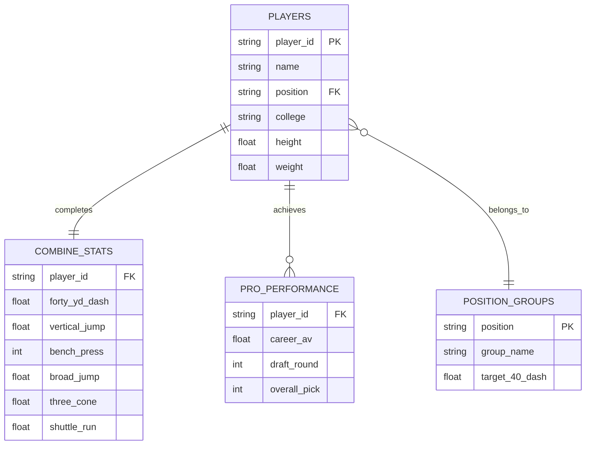

# DS 4320 Project 1: NFL Combine Performance as a Predictor for Career Value

```mermaid
erDiagram
    PLAYERS ||--|| COMBINE_STATS : completes
    PLAYERS ||--o{ PRO_PERFORMANCE : achieves
    PLAYERS }o--|| POSITION_GROUPS : belongs_to

    PLAYERS {
        string player_id PK
        string name
        string position FK
        string college
        float height
        float weight
    }

    COMBINE_STATS {
        string player_id FK
        float forty_yd_dash
        float vertical_jump
        int bench_press
        float broad_jump
        float three_cone
        float shuttle_run
    }

    PRO_PERFORMANCE {
        string player_id FK
        float career_av
        int draft_round
        int overall_pick
    }

    POSITION_GROUPS {
        string position PK
        string group_name
        float target_40_dash
    }

```
