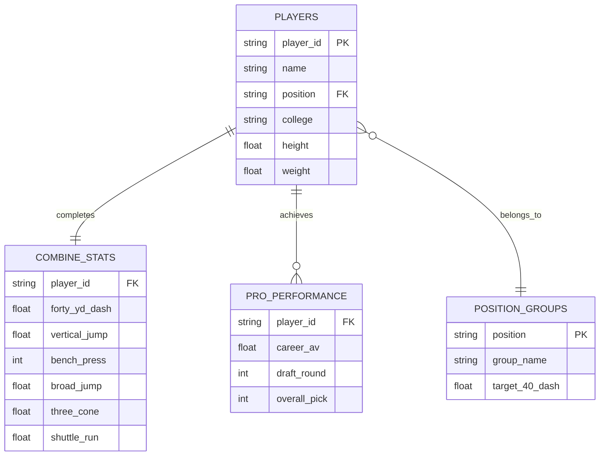

# DS 4320 Project 1: NFL Combine Performance as a Predictor for Career Value

# Project Details

## Executive Summary

This project develops a relational data model (D') derived from historical NFL Combine metrics and professional career statistics. The objective is to identify the correlation between specific athletic "measurables" (speed, explosion, and agility) and a player's long-term professional contribution as measured by Career Approximate Value (CAV). The resulting pipeline transforms raw flat-file data into a normalized database, applies machine learning to predict performance value, and provides position-specific benchmarks for athletic evaluation.

### Name: 
Kieran Perdue
### NetID: 
rrx5eg
### DOI: 
[10.5281/zenodo.19361124](https://doi.org/10.5281/zenodo.19361124)
### Press Release: 
[press_release.md](./press_release.md)
### Data: 
[UVA OneDrive Folder](https://myuva-my.sharepoint.com/:f:/r/personal/rrx5eg_virginia_edu/Documents/Project%201%20Data%20Folder?csf=1&web=1&e=MhzQIg)
### Pipeline (Jupyter): 
[pipeline.ipynb](./pipeline/pipeline.ipynb)
### Pipeline (Markdown): 
[pipeline.md](./pipeline/pipeline.md)
### License:
[MIT](./LICENSE)

## Problem Definition

General Problem: Projecting athletic performance.

Specific Problem: Predicting a player's "Career Approximate Value" (CAV) based on standardized athletic testing metrics to identify prospects whose professional potential is overlooked by traditional draft valuation.

### Rationale

Current draft models often rely heavily on "draft stock" and collegiate production, which are subject to high variance based on competition level and team scheme. Standardized Combine metrics provide a "level playing field" for physical comparison. By refining the problem to focus on CAV—a position-neutral longevity metric—this project aims to distinguish between players who are simply "workout warriors" and those whose athletic profiles correlate with high-value NFL careers.

### Motivation

The motivation is to provide front-office scouts with a data-driven "Value Index." High-round draft busts represent significant financial and competitive losses for NFL franchises. This project seeks to minimize that risk by establishing athletic threshold baselines that historically lead to professional success.

### Headline 

The NFL Combine is a Spectacle, Not a Crystal Ball: Why Athletic Metrics Don't Guarantee GridironGreatness
[Link](./press_release.md)

## Domain Exposition
This project operates within the domain of **Advanced Sports Analytics and Talent Valuation**. Specifically, it explores the intersection of biometric performance data (NFL Combine results) and long-term professional econometrics (Career Approximate Value). For decades, NFL talent evaluation has relied heavily on  isolated athletic testing. This project applies predictive modeling and relational database management to this domain, aiming to replace subjective "gut feelings" with objective, data-driven frameworks that can accurately quantify a prospect's future value for a professional franchise.

## Terminology

Terminology

| Term | Definition |
|---|---|
| **CAV** | **Career Approximate Value**: A non-cumulative value metric developed by Pro-Football-Reference to measure a player's contribution to their team. |
| **40-Yard Dash** | A test of absolute explosive speed; the most emphasized metric in traditional scouting. |
| **3-Cone Drill** | A test of agility and lateral change-of-direction, often more predictive for skill positions than straight-line speed. |
| **PVI** | **Performance Value Index**: A custom KPI representing the ratio of professional production to athletic percentile. |
| **Trench (Position Group)** | Linemen who play at the line of scrimmage, primarily responsible for blocking or shedding blocks (e.g., Offensive Line, Defensive Line). |
| **Skill (Position Group)** | Players who primarily handle the football or cover receivers in open space (e.g., Wide Receivers, Running Backs, Defensive Backs). |
| **Big Skill (Position Group)** | Hybrid players who possess both blocking responsibilities and receiving skills (e.g., Tight Ends). |

## Background Readings
**Folder** https://drive.google.com/drive/folders/1aFAPdv9FK4VBSBXO30m4cr7RYpq_7C-N?usp=drive_link 

| Title | Brief Description | Link to File in Folder |
|---|---|---|
| **Explosive Strength and Speed as Potential Determinants of Success in Youth Figure Skating Competitions** | This study demonstrates that explosive strength and speed, measured through field tests like horizontal jumps and ice sprints, are significant predictors of competition success in youth figure skaters. This provides a basis for evaluating raw atheltic talent as a predictor of performance | [View PDF](https://drive.google.com/file/d/1KF_Xz0HvXC-BNFJrZMGD34iZxqKTXmQg/view?usp=drive_link) |
| **Approximate Value** | Detailed documentation of the "Approximate Value" (AV) methodology, providing the framework for our dependent variable used to quantify professional contribution. | [View PDF](https://drive.google.com/file/d/1zr8w3IBZDDnYIt4wSVJuLshf6pgRwpF7/view?usp=drive_link) |
| **Normative and limit values of speed, endurance and power tests results of young football players** | This study established standardized percentile charts for speed, power, and endurance in young male football players aged 12–16, identifying the age of 13 to 14 as a period of significant motor skill development and highlighting the value of these normative benchmarks for individualizing training and monitoring athletic progress. | [View PDF](https://drive.google.com/file/d/18RjztSUuTVU-pEg9qS1dBC2mDrkMCFd7/view?usp=drive_link) |
| **THE NFL COMBINE: DOES IT PREDICT PERFORMANCE IN THE NATIONAL FOOTBALL LEAGUE?** | The 2008 study investigates the predictive validity of the NFL combine and concludes that most physical tests and the Wonderlic Personnel Test fail to consistently correlate with professional success for quarterbacks, wide receivers, and running backs, with the notable exception of sprint tests for running backs. | [View PDF](https://drive.google.com/file/d/1LUen5nk0WU3vVjOuorxo7VwyL39VgPh4/view?usp=drive_link) |
| **Advancing NFL win prediction: from Pythagorean formulas to machine learning algorithms** | A technical paper demonstrating multivariate modeling techniques to aggregate multiple Combine variables into a single, actionable "Value Forecast." | [View PDF](https://drive.google.com/file/d/1pALDEpmU-k3J7suMpHtYE-uVvlnZjxqW/view?usp=drive_link) |

## Data Creation

### Provenance

The raw data for this project was acquired from a Kaggle dataset containing historical NFL Combine results (1999-2022) merged with professional statistics scraped from Pro-Football-Reference.

### Codebase for Data Creation

### Codebase for Data Creation

| File | Description | Link |
|---|---|---|
| `convert_to_parquet.py` | Python script that cleans raw CSV data and converts it into optimized Parquet files for storage. | [Link](./convert_to_parquet.py) |
| `pipeline.ipynb` | Jupyter Notebook containing the DuckDB SQL pipeline that ingests the Parquet files and constructs the relational database (D'). | [Link](./pipeline/pipeline.ipynb) |
| `requirements.txt` | A text file listing the Python dependencies (e.g., duckdb, pandas, pyarrow) required to reproduce this data pipeline. | [Link](./requirements.txt) |

### Bias Identification & Mitigation

Selection Bias: Only top-tier prospects are invited to the NFL Combine. The dataset lacks "average" athletes, creating a high-performance floor.

Survivor Bias: Players who appear in the performance table are those who actually played in the NFL. Prospects who were drafted but never played have a CAV of 0.

### Mitigation: 

We mitigate this by including a POSITION_GROUPS reference table to normalize athletic scores against positional averages rather than the entire population.

### Rationale for Critical Decisions & Uncertainty Management

To transform raw NFL Combine data into an actionable predictive model, several critical judgement calls were made regarding data structuring and analysis. First, we chose Career Approximate Value (CAV) as the dependent variable rather than Draft Position because draft position measures a team's expectation of a player—which is inherently biased by Combine hype—whereas CAV measures actual, realized professional production. Because CAV is a proprietary, subjective index, it introduces some uncertainty; to mitigate this, we explicitly noted a +/- 1.5 margin of error in our Data Dictionary. Second, we addressed incomplete Combine profiles by strictly filtering our training data to only include complete profiles rather than mathematically imputing missing metrics, ensuring our model identifies correlations based entirely on proven measurements rather than synthetic data. Finally, we selected a Random Forest algorithm because athleticism does not scale linearly, and this model naturally handles non-linear thresholds and complex interactions while remaining robust to extreme athletic outliers that might otherwise skew baseline predictions.

## Metadata

### Schema (Logical ER Diagram)

### Data Tables

| Table Name | Description | Link to CSV |
|---|---|---|
| `players` | Core biographical information for each drafted prospect (name, college, physical attributes). | [View CSV](./data/players.csv) |
| `combine_stats` | Raw athletic testing results from the NFL Combine (40-yard dash, vertical, bench press, etc.). | [View CSV](./data/combine_stats.csv) |
| `pro_performance` | Professional career statistics, draft position, and Career Approximate Value (CAV). | [View CSV](./data/pro_performance.csv) |
| `position_groups` | Reference table categorizing specific player positions into broader tactical groups (Trench/Skill). | [View CSV](./data/position_groups.csv) |

### Data Dictionary

| Table | Feature | Type | Description | Example | Uncertainty |
|---|---|---|---|---|---|
| PLAYERS | `player_id` | Integer | Unique surrogate key identifying each player record | 1052 | None — system generated |
| PLAYERS | `name` | String | Full name of the NFL prospect | Calvin Johnson | None — official record |
| PLAYERS | `position` | String | Designated roster position abbreviation | WR | None — official record |
| PLAYERS | `college` | String | College or university the player attended | Georgia Tech | None — official record |
| PLAYERS | `height` | Float | Player height converted to decimal inches | 77.0 | +/- 0.5 in (manual measurement) |
| PLAYERS | `weight` | Integer | Official weigh-in weight in pounds | 239 | +/- 1.0 lb (scale accuracy) |
| COMBINE_STATS | `player_id` | Integer | Foreign key linking to PLAYERS table | 1052 | None — system generated |
| COMBINE_STATS | `forty_yd_dash` | Float | Time in seconds to run 40 yards from a standing start | 4.35 | +/- 0.05s (electronic timing) |
| COMBINE_STATS | `vertical_jump` | Float | Maximum vertical leap height in inches | 38.5 | +/- 0.5 in (measurement device) |
| COMBINE_STATS | `bench_press` | Integer | Number of reps of 225 lbs completed on bench press | 27 | +/- 1 rep (observer count) |
| COMBINE_STATS | `broad_jump` | Float | Standing broad jump distance in inches | 130.0 | +/- 1.0 in (tape measure) |
| COMBINE_STATS | `three_cone` | Float | Time in seconds to complete the 3-cone agility drill | 6.89 | +/- 0.05s (electronic timing) |
| COMBINE_STATS | `shuttle_run` | Float | Time in seconds to complete the 20-yard short shuttle | 4.12 | +/- 0.05s (electronic timing) |
| PRO_PERFORMANCE | `player_id` | Integer | Foreign key linking to PLAYERS table | 1052 | None — system generated |
| PRO_PERFORMANCE | `career_av` | Float | Cumulative Career Approximate Value across all NFL seasons | 106.0 | +/- 1.5 (subjective index methodology) |
| PRO_PERFORMANCE | `draft_round` | Integer | Round in which the player was selected in the NFL Draft | 1 | None — official record |
| PRO_PERFORMANCE | `overall_pick` | Integer | Overall pick number in the NFL Draft | 2 | None — official record |
| POSITION_GROUPS | `position` | String | Primary key — position abbreviation matching PLAYERS table | WR | None — official record |
| POSITION_GROUPS | `group_name` | String | Broader tactical position group the position belongs to | Skill | None — defined categorization |
| POSITION_GROUPS | `target_40_dash` | Float | Position-group benchmark 40-yard dash time used for normalization | 4.45 | +/- 0.05s (positional average) |
